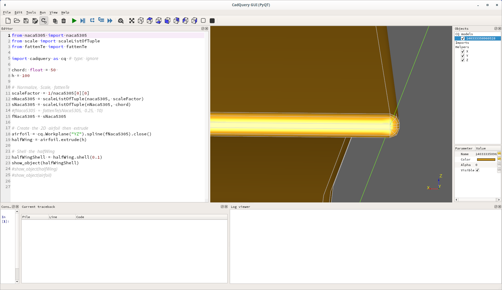
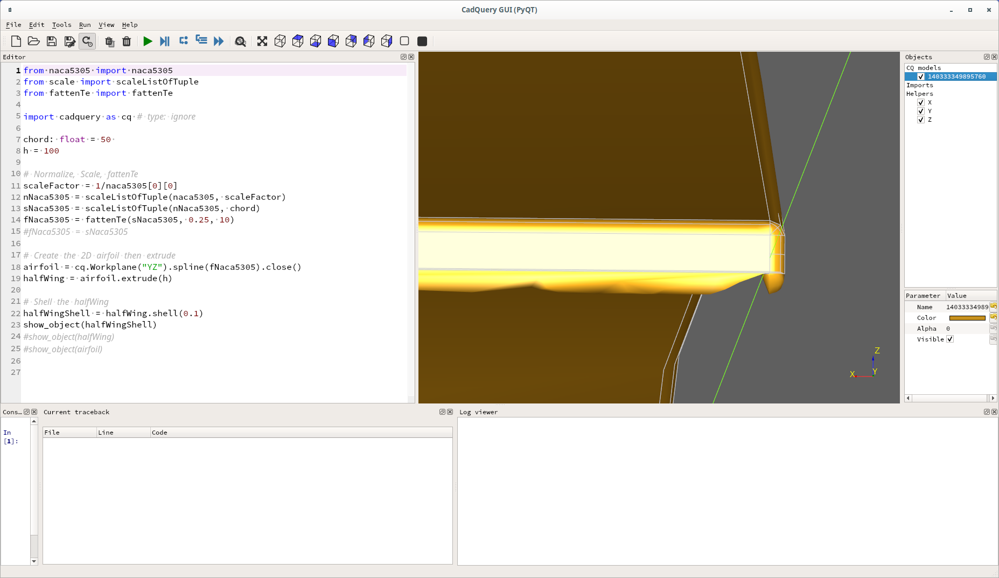

# Wing with ribs

WIP

nwing.py is the naca5305 airfoil which has anomalies at the trailing
edge when fattened. Specifically there is a "notch". See best by comparing
the follow two images, the other images show the TE from different perspectives.

halfWingShell-nrmlTe-shell_+0.1-yAxis-3.png:

halfWingShell-fatTe-shell_+0.1-yAxis-3.png:

